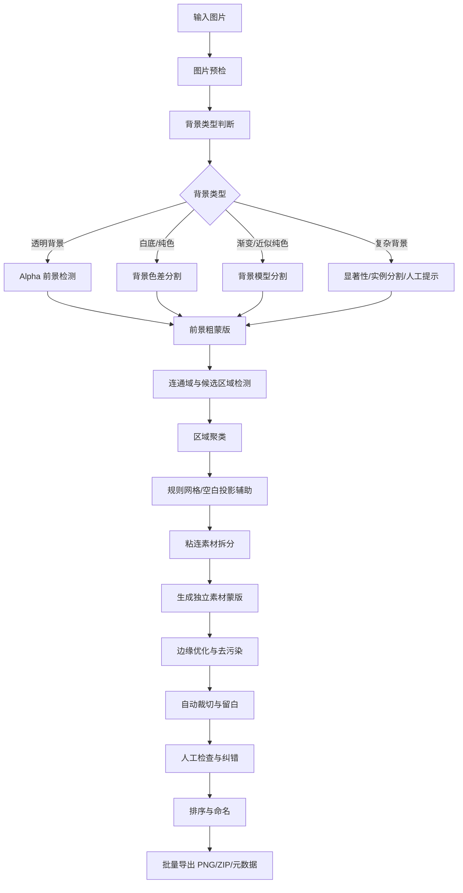

# 单张图片多素材自动定位、分割与 PNG 批量导出系统需求说明

> 文档版本：V1.0  
> 任务类型：图像算法与工程实现  
> 目标使用方：产品、前端、后端、算法、测试、Codex 开发  
> 核心边界：从一张图片中定位并提取多个独立素材，分别输出透明背景 PNG，不涉及 SVG 锚点优化

---

## 1. 项目背景

用户经常获得一张包含多个图标、人物、商品、装饰元素或其他素材的图片，希望将其中每个素材分别提取出来并保存为独立 PNG 文件。

常见问题包括：

1. 一个素材可能由多个互不连通的区域组成；
2. 多个素材之间距离很近，容易被合并；
3. 带阴影、外发光或半透明边缘的素材难以准确分割；
4. 白色素材可能与白色背景混在一起；
5. JPG 压缩噪声会影响边缘判断；
6. 规则网格和不规则排列需要不同定位策略；
7. 人物、商品和图标的分割难度不同；
8. 复杂背景下仅靠颜色阈值难以可靠提取；
9. 自动算法无法保证所有图片 100% 正确，需要人工快速纠错；
10. 输出 PNG 还需要统一命名、裁切、留白和批量下载。

因此需要开发一套“背景判断—候选检测—区域聚类—实例分割—人工纠错—批量导出”的多素材提取系统。

---

## 2. 项目目标

系统接收一张包含多个素材的图片，自动完成：

1. 判断图片背景类型；
2. 定位所有素材候选区域；
3. 判断哪些不连通区域属于同一素材；
4. 判断哪些粘连区域包含多个素材；
5. 为每个素材生成独立蒙版；
6. 去除背景；
7. 保留必要的阴影和半透明边缘；
8. 自动裁切并添加安全留白；
9. 为每个素材输出透明背景 PNG；
10. 输出素材位置和尺寸信息；
11. 支持用户合并、拆分、删除和修正蒙版；
12. 支持批量 ZIP 下载。

---

## 3. 核心设计原则

### 3.1 多策略路由

不同图片必须使用不同策略，不得只使用单一连通域算法。

### 3.2 自动识别与人工纠错结合

第一版不追求所有图片完全自动化。必须提供：

- 合并；
- 拆分；
- 删除；
- 边界调整；
- 蒙版画笔。

### 3.3 检测、分割、裁切、导出解耦

系统应拆分为独立模块：

```text
背景判断
→ 前景粗分割
→ 素材候选检测
→ 区域聚类
→ 粘连拆分
→ 精细蒙版
→ 裁切与留白
→ 导出
```

### 3.4 参数相对化

所有距离、面积、留白和形态学核尺寸优先相对于图片尺寸或平均素材尺寸计算，不应只使用固定像素。

---

## 4. 任务范围

### 4.1 本期包含

1. PNG、JPG、JPEG、WebP 输入；
2. Alpha 通道检测；
3. 白底和纯色背景检测；
4. 近似纯色背景检测；
5. 前景粗分割；
6. 连通域分析；
7. 形态学处理；
8. 区域聚类；
9. 空白投影切割；
10. 粘连素材基础拆分；
11. 素材候选框生成；
12. Alpha 蒙版生成；
13. 透明背景 PNG 输出；
14. 自动裁切和留白；
15. 合并、拆分、删除；
16. 蒙版画笔；
17. 批量下载；
18. 位置元数据输出。

### 4.2 后续增强

1. 渐变背景精细建模；
2. 复杂照片背景；
3. 人物实例分割；
4. 商品实例分割；
5. 前后遮挡对象分离；
6. AI 语义分割；
7. SAM 类交互式分割；
8. 素材自动命名；
9. 素材分类与标签；
10. 相似素材去重；
11. 超分辨率放大。

### 4.3 本期不包含

1. SVG 锚点优化；
2. SVG 路径修复；
3. 位图转矢量；
4. 一张图拆成多个 SVG；
5. 视频对象提取；
6. 被遮挡部分自动补全；
7. 复杂三维对象恢复。

---

## 5. 用户角色与使用场景

### 5.1 用户角色

- 设计师；
- PPT/Word 素材平台用户；
- 图标素材生产者；
- AI 图片生成用户；
- 电商素材运营；
- 图片自动化处理平台；
- 内容编辑人员。

### 5.2 典型使用场景

1. 一张图片包含多个图标；
2. 一张图片包含多个人物动作；
3. 一张图片包含多个商品；
4. 一张图片包含多个装饰元素；
5. 一张白底图中包含多个独立对象；
6. 一张透明 PNG 中包含多个素材；
7. 图片中带编号、文字或水印；
8. 素材之间距离很小；
9. 一个素材由多个独立组件组成；
10. 多个素材轻微粘连。

---

## 6. 输入要求

### 6.1 支持格式

- PNG
- JPG
- JPEG
- WebP

### 6.2 建议限制

- 单文件不超过 30 MB；
- 最大尺寸不超过 10,000 × 10,000；
- 最多候选素材数默认 500；
- 最少包含 1 个前景对象；
- 对严重重叠对象仅保证检测，不保证完全分离。

### 6.3 用户配置

#### 背景类型

- 自动；
- 透明背景；
- 白色背景；
- 纯色背景；
- 近似纯色背景；
- 复杂背景。

#### 提取模式

- 自动；
- 图标；
- 人物；
- 商品；
- 装饰素材；
- 通用对象。

#### 阴影设置

- 自动；
- 保留阴影；
- 去除阴影。

#### 文字设置

- 保留文字；
- 去除文字；
- 自动判断。

#### 分割参数

- 最小素材面积；
- 素材内部连接距离；
- 素材之间最小间距；
- 形态学处理强度；
- 边缘羽化；
- 外侧留白；
- 背景颜色容差；
- 粘连拆分强度。

---

## 7. 输出要求

### 7.1 输出文件

```text
asset_001.png
asset_002.png
asset_003.png
...
```

### 7.2 PNG 输出标准

每个 PNG 应：

1. 背景透明；
2. 只包含一个主要素材；
3. 不包含相邻素材；
4. 不裁掉主体；
5. 保留适当安全留白；
6. 保持原比例；
7. 默认不拉伸；
8. 可选择统一画布；
9. 可选择保留阴影；
10. 半透明边缘无明显白边或黑边。

### 7.3 元数据输出

```json
{
  "sourceFile": "sheet.png",
  "assetCount": 24,
  "assets": [
    {
      "file": "asset_001.png",
      "x": 120,
      "y": 45,
      "width": 64,
      "height": 64,
      "maskArea": 4096,
      "confidence": 0.97,
      "status": "auto-confirmed"
    }
  ]
}
```

### 7.4 可选输出

- 检测标注图；
- JSON；
- CSV；
- ZIP；
- 单素材预览图；
- 黑底/白底预览。

---

## 8. 总体处理流程



---

## 9. 图片预检

检查：

1. 文件是否可读取；
2. 图片尺寸；
3. 通道数量；
4. 是否包含 Alpha；
5. Alpha 是否有效；
6. 是否完全透明；
7. 是否全部为单色；
8. EXIF 方向；
9. 分辨率是否过低；
10. 是否有严重压缩；
11. 是否超过资源限制；
12. 是否可能为空图。

异常返回明确错误信息。

---

## 10. 背景类型判断

系统应分析：

1. Alpha 通道分布；
2. 四角颜色；
3. 边缘区域颜色；
4. 边缘颜色方差；
5. 颜色聚类结果；
6. 图片边界连续性；
7. 前景与背景的色差；
8. 背景是否存在渐变；
9. 背景纹理复杂度。

输出：

```ts
type BackgroundType =
  | "transparent"
  | "solid"
  | "near-solid"
  | "gradient"
  | "complex"
  | "unknown";
```

同时输出置信度。

当背景置信度低于阈值时，应提示用户手动选择。

---

## 11. 不同背景的处理策略

### 11.1 透明背景

流程：

```text
读取 Alpha
→ 设置前景阈值
→ 生成前景蒙版
→ 去噪
→ 修孔
→ 连通域
→ 区域聚类
→ 候选框
```

优势：

- 准确率最高；
- 可保留半透明边缘；
- 不依赖颜色。

风险：

- 一个素材被拆成多个连通域；
- 阴影被识别为独立对象；
- 极浅透明边缘被漏掉。

---

### 11.2 白底或纯色背景

流程：

```text
采样四角与边缘
→ 估计背景色
→ 计算像素与背景色差
→ 生成前景概率
→ 软蒙版
→ 连通域
→ 聚类与切分
→ 边缘去污染
```

建议颜色空间：

- 优先 Lab；
- 辅助 HSV；
- RGB 仅作基础方案。

风险：

- 白色对象与白色背景；
- 浅色阴影；
- JPG 压缩噪声；
- 背景亮度不一致。

---

### 11.3 近似纯色或渐变背景

流程：

```text
边缘采样
→ 建立背景模型
→ 预测局部背景色
→ 计算局部差异
→ 前景概率
→ 区域生长或 GrabCut
→ 候选区域
```

风险：

- 前景颜色接近背景；
- 背景纹理误识别；
- 光照变化过大。

---

### 11.4 复杂背景

第一版建议定义为实验性能力。

可选策略：

- 显著性检测；
- 通用目标检测；
- 实例分割；
- SAM 类点击或框选分割；
- 用户手动画框；
- 用户画前景/背景提示。

复杂背景下不得承诺全自动高准确率。

---

## 12. 前景粗分割

输出：

- 二值前景蒙版；
- 软 Alpha 蒙版；
- 前景概率图；
- 背景概率图。

对抗锯齿和阴影应尽可能保留软边，而不是直接二值化。

---

## 13. 连通域检测

对每个连通区域计算：

1. 面积；
2. 外接框；
3. 质心；
4. 周长；
5. 宽高比；
6. 平均颜色；
7. 平均透明度；
8. 轮廓复杂度；
9. 与其他区域的距离；
10. 是否靠近图片边缘；
11. 是否包含孔洞；
12. 是否可能为阴影。

数据结构：

```ts
interface ConnectedRegion {
  id: string;
  area: number;
  bbox: { x: number; y: number; width: number; height: number };
  centroid: { x: number; y: number };
  averageColor: [number, number, number];
  averageAlpha: number;
  contourComplexity: number;
}
```

---

## 14. 形态学处理

使用：

- 开运算：去除孤立噪点；
- 闭运算：填补边缘小缺口；
- 膨胀：连接同一素材的多个部件；
- 腐蚀：分开轻微粘连；
- 距离变换：辅助粘连拆分。

结构核尺寸必须自适应。

推荐依据：

- 图片短边；
- 平均候选素材尺寸；
- 当前局部区域尺寸；
- 用户“连接距离”参数。

---

## 15. 区域聚类

一个素材可能由多个互不相连的区域组成，例如：

- Wi-Fi 图标；
- 三点菜单；
- 太阳；
- 人物头部与身体；
- 图形与文字；
- 主体与阴影。

聚类特征包括：

1. 最短距离；
2. 质心距离；
3. 相对尺寸；
4. 水平/垂直排列；
5. 颜色相似性；
6. Alpha 相似性；
7. 阴影方向；
8. 是否处于同一局部空白区域；
9. 是否形成规律组合；
10. 与其他候选对象的分隔程度；
11. 是否存在包含关系。

聚类应采用评分机制，而非单一固定距离。

---

## 16. 规则网格与空白投影

适用于图标素材表、规则排列图。

流程：

1. 计算水平前景投影；
2. 找到明显水平空白带；
3. 切分行；
4. 对每行计算垂直投影；
5. 找到列间空白；
6. 生成初始格子；
7. 根据实际前景外接框细化。

空白投影只能作为辅助策略，不能替代区域检测。

---

## 17. 粘连素材拆分

当一个候选区域可能包含多个素材时，使用：

1. 距离变换；
2. 分水岭；
3. 轮廓凹点检测；
4. 空白谷值；
5. 水平/垂直投影；
6. 骨架分析；
7. 实例分割模型；
8. 用户手动画分割线。

不得只依赖腐蚀，因为腐蚀可能破坏细线对象。

---

## 18. 噪点与真实小组件判断

小区域可能是：

- 三点菜单中的点；
- 字母上的点；
- 眼睛高光；
- 小星星；
- 图标内部元素；
- 阴影碎片；
- 背景噪声。

自动删除应同时满足：

1. 面积很小；
2. 距离主体较远；
3. 无规律排列；
4. 与主体颜色不一致；
5. 不处于主体附近；
6. 不属于孔洞或内部结构；
7. 删除置信度高。

否则应保留或归入附近主体。

---

## 19. 蒙版生成

### 19.1 硬蒙版

适合：

- 实心图标；
- 扁平形状；
- 无阴影；
- 高对比边缘。

### 19.2 软蒙版

适合：

- 头发；
- 柔和阴影；
- 抗锯齿；
- 外发光；
- 半透明对象。

软蒙版必须保留 0～255 Alpha，而非只有 0 和 255。

### 19.3 边缘去污染

为避免白边/黑边：

1. 估计背景颜色；
2. 对半透明边缘去背景色污染；
3. 重建边缘颜色；
4. 在黑底和白底上预览验证。

---

## 20. 阴影处理

### 20.1 保留阴影

- 阴影与主体聚为一个素材；
- 保留半透明；
- 扩大裁切边界；
- 防止阴影截断。

### 20.2 去除阴影

- 根据透明度、颜色、模糊度、偏移方向识别；
- 删除低透明阴影；
- 保留主体；
- 防止误删灰色对象。

### 20.3 自动模式

建议：

- 图标：默认去阴影；
- 商品：默认保留自然阴影；
- 人物：默认不保留远距离投影；
- 装饰素材：按用户设置。

---

## 21. 候选框生成

每个素材生成一个候选框。

要求：

1. 覆盖完整主体；
2. 不覆盖相邻素材；
3. 保留阴影时包含阴影；
4. 添加安全留白；
5. 不超出图片边界；
6. 对小素材可扩大预览框；
7. 框与蒙版相互关联。

---

## 22. 人工纠错

### 22.1 合并

用户选择多个区域合并为一个素材。

适用：

- 一个素材被拆成多个；
- 主体与阴影分离；
- 人物头部与身体分离。

### 22.2 拆分

支持：

- 绘制分割线；
- 创建多个新框；
- 矩形选择；
- 自动分水岭；
- 前景标记点。

适用：

- 两个素材被合并；
- 间距过小；
- 边缘轻微粘连。

### 22.3 删除

删除：

- 噪点；
- 编号；
- 无关文字；
- 水印；
- 背景残留。

### 22.4 蒙版画笔

提供：

- 增加前景；
- 擦除前景；
- 软硬画笔；
- 羽化；
- 撤销；
- 重做；
- 边缘平滑。

---

## 23. 排序与命名

默认顺序：

1. 从上到下；
2. 同一行从左到右；
3. 使用质心和行聚类判断。

支持：

- 拖拽排序；
- 自定义名称；
- 文件名前缀；
- 编号位数；
- 批量重命名。

示例：

```text
icon_001.png
icon_002.png
icon_003.png
```

---

## 24. 输出画布策略

### 24.1 紧凑裁切

按素材外接框加留白输出。

### 24.2 统一方形画布

例如：

- 256 × 256；
- 512 × 512；
- 1024 × 1024。

规则：

- 等比例缩放；
- 居中；
- 不拉伸；
- 保留安全边距。

### 24.3 保持原始像素

只裁切，不缩放。

---

## 25. 前端需求

### 25.1 上传页

- 文件上传；
- 图片预览；
- 背景类型判断结果；
- 提取模式；
- 参数预设；
- 文件限制提示。

### 25.2 检测页

显示：

- 原图；
- 候选框；
- 编号；
- 置信度；
- 低置信度高亮；
- 是否包含多个区域；
- 是否疑似粘连；
- 是否包含阴影。

### 25.3 编辑页

支持：

- 框选；
- 合并；
- 拆分；
- 删除；
- 蒙版画笔；
- 缩放；
- 黑白底切换；
- 单素材预览；
- 批量选择；
- 顺序调整；
- 名称修改。

### 25.4 导出页

支持：

- 单个下载；
- 全部下载；
- ZIP；
- 透明背景；
- 白底/黑底预览；
- 统一尺寸；
- 命名规则；
- JSON/CSV 元数据。

---

## 26. 算法策略路由

### 26.1 有效 Alpha

```text
Alpha 前景检测
→ 去噪
→ 连通域
→ 区域聚类
→ 外接框
→ 蒙版优化
→ PNG 导出
```

### 26.2 白底或纯色背景

```text
背景颜色估计
→ Lab 色差前景检测
→ 软蒙版
→ 连通域
→ 聚类与切分
→ 边缘去污染
→ PNG 导出
```

### 26.3 规则网格

```text
前景粗分割
→ 水平投影
→ 行切分
→ 垂直投影
→ 列切分
→ 区域细化
→ PNG 导出
```

### 26.4 一个素材多组件

```text
连通域
→ 距离/排列/颜色分析
→ 区域聚类
→ 同一素材合并
→ 蒙版生成
```

### 26.5 多个素材粘连

```text
粘连检测
→ 凹点分析
→ 距离变换
→ 分水岭
→ 投影校验
→ 低置信度人工确认
```

### 26.6 复杂背景

```text
显著性/实例分割
→ 候选对象
→ 用户确认
→ 精细蒙版
→ 边缘优化
→ PNG 导出
```

---

## 27. 置信度机制

每个候选素材计算置信度，依据：

1. 与背景分离程度；
2. 边界完整度；
3. 区域聚类稳定性；
4. 与其他素材的分隔程度；
5. 蒙版连贯性；
6. 是否截断；
7. 是否包含多个大主体；
8. 是否严重粘连；
9. 是否包含过多背景；
10. 多种算法结果是否一致。

低置信度时：

- 高亮；
- 提示检查；
- 不直接标记为完全成功；
- 提供一键合并或拆分建议。

---

## 28. 后端接口建议

### 28.1 创建提取任务

```http
POST /api/asset-extraction/tasks
Content-Type: multipart/form-data
```

参数示例：

```json
{
  "backgroundType": "auto",
  "assetMode": "icon",
  "shadowMode": "auto",
  "minAssetAreaRatio": 0.0001,
  "mergeDistanceRatio": 0.01,
  "paddingRatio": 0.05,
  "backgroundTolerance": 15,
  "outputCanvas": "tight",
  "outputFormat": "png"
}
```

### 28.2 查询任务

```http
GET /api/asset-extraction/tasks/{taskId}
```

### 28.3 获取候选素材

```http
GET /api/asset-extraction/tasks/{taskId}/assets
```

### 28.4 合并素材

```http
POST /api/asset-extraction/tasks/{taskId}/merge
```

```json
{
  "assetIds": ["asset-3", "asset-4"]
}
```

### 28.5 拆分素材

```http
POST /api/asset-extraction/tasks/{taskId}/split
```

### 28.6 更新蒙版

```http
PUT /api/asset-extraction/tasks/{taskId}/assets/{assetId}/mask
```

### 28.7 批量导出

```http
POST /api/asset-extraction/tasks/{taskId}/export
```

---

## 29. 数据结构建议

```ts
interface AssetExtractionTask {
  id: string;
  status: "pending" | "processing" | "editing" | "completed" | "failed";
  sourceFile: string;
  config: AssetExtractionConfig;
  assets: ExtractedAsset[];
  createdAt: string;
  updatedAt: string;
}
```

```ts
interface ExtractedAsset {
  id: string;
  name: string;
  bbox: {
    x: number;
    y: number;
    width: number;
    height: number;
  };
  confidence: number;
  regionIds: string[];
  maskFile?: string;
  previewFile?: string;
  status:
    | "auto-confirmed"
    | "needs-review"
    | "manually-edited"
    | "deleted";
}
```

---

## 30. 性能要求

建议第一版目标：

1. 2000 × 2000 图片：处理时间不超过 3 秒；
2. 5000 × 5000 图片：处理时间不超过 10 秒；
3. 最多支持 500 个候选素材；
4. 编辑操作实时响应；
5. 大图使用缩略图交互；
6. 最终导出使用原图分辨率；
7. 支持取消；
8. 支持重试；
9. ZIP 生成不得阻塞主线程；
10. 支持任务进度。

---

## 31. 异常处理

需要覆盖：

1. 图片无法读取；
2. Alpha 通道为空；
3. 图片完全透明；
4. 图片全部为背景色；
5. 无法检测素材；
6. 检测数量异常过多；
7. 所有素材粘连；
8. 背景判断失败；
9. 分辨率过低；
10. 尺寸过大；
11. 内存不足；
12. 单素材导出失败；
13. ZIP 生成失败；
14. 元数据生成失败；
15. 蒙版编辑失败。

---

## 32. 测试数据集

至少准备：

1. 透明背景图标合集；
2. 白底黑色图标；
3. 白底彩色图标；
4. 浅灰底素材；
5. 单一纯色背景；
6. 渐变背景；
7. 规则网格；
8. 不规则排列；
9. 尺寸不一致；
10. 素材间距很小；
11. 单素材多组件；
12. 两素材轻微粘连；
13. 带阴影；
14. 带外发光；
15. 带文字和编号；
16. 人物动作合集；
17. 商品合集；
18. 装饰素材合集；
19. 低分辨率；
20. JPG 严重压缩；
21. 白色素材配白色背景；
22. 黑色素材配深色背景；
23. 半透明玻璃；
24. 超过 100 个素材的大图。

每个失败案例必须进入回归测试集。

---

## 33. 验收指标

### 33.1 检测指标

建议第一版目标：

- 透明底普通素材数量识别准确率：≥ 95%；
- 白底高对比素材识别准确率：≥ 90%；
- 单素材错误拆分率：< 5%；
- 多素材错误合并率：< 5%；
- 低置信度案例可被正确标记；
- 常见错误可在 3 次操作内修正。

### 33.2 输出质量

1. 输出 PNG 背景透明；
2. 主体不被明显裁断；
3. 相邻素材残留低；
4. 边缘无明显白边或黑边；
5. 保留阴影时阴影完整；
6. 去除阴影时主体不被误删；
7. 输出顺序正确；
8. ZIP 可正常解压；
9. 元数据与实际位置一致。

### 33.3 产品指标

以一张包含 40 个普通透明底素材的图片为例：

- 自动正确提取不少于 36 个；
- 人工修正次数不超过 4 次；
- 人工修正时间不超过 30 秒；
- 全部导出操作不超过 1 分钟。

---

## 34. 迭代计划

### 阶段一：透明底与白底 MVP

- Alpha 检测；
- 白底检测；
- 连通域；
- 形态学处理；
- 区域聚类；
- 外接框；
- PNG 裁切；
- ZIP 下载。

### 阶段二：人工纠错

- 合并；
- 拆分；
- 删除；
- 边界调整；
- 蒙版画笔；
- 排序与命名。

### 阶段三：复杂情况增强

- 阴影识别；
- 渐变背景；
- 粘连拆分；
- 空白投影；
- 软蒙版；
- 边缘去污染。

### 阶段四：AI 分割增强

- 人物实例分割；
- 商品实例分割；
- 通用对象分割；
- 点击提示分割；
- 自动标签；
- 失败样本持续学习。

---

## 35. 最终交付物

1. 图片背景判断模块；
2. 前景粗分割模块；
3. 连通域检测模块；
4. 区域聚类模块；
5. 粘连拆分模块；
6. 蒙版生成与边缘优化模块；
7. 裁切与留白模块；
8. PNG/ZIP 导出模块；
9. 前端可视化编辑页面；
10. 后端任务接口；
11. 元数据导出；
12. 测试数据集；
13. 自动化回归测试；
14. 部署和使用文档。
