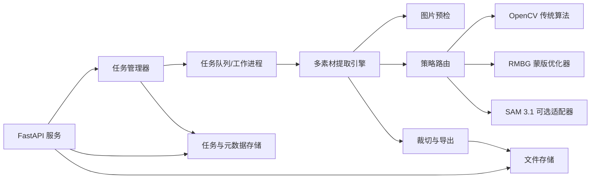
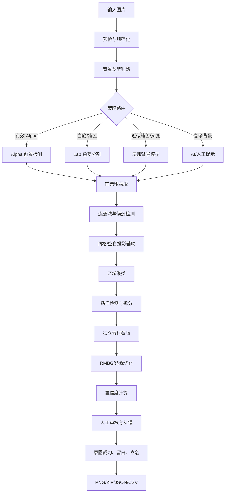
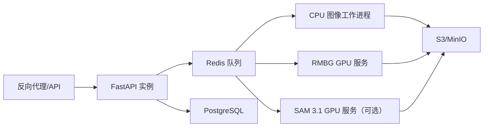

# 单张图片多素材自动提取系统技术架构

> 文档版本：V1.0  
> 编写日期：2026-07-13  
> 项目阶段：透明底与白底 MVP 设计  
> 需求依据：task_2_multi_asset_png_extraction_requirements.md 
> 核心目标：从一张图片中定位多个独立素材，分别输出透明背景 PNG，并支持人工纠错、批量导出和位置元数据。

---

## 1. 文档目的

本文档用于统一产品、算法、后端和测试的实现边界，并作为任务拆分、接口联调、部署和验收依据。

本系统不是一个单纯的“整图去背景工具”。它需要完成四类相互独立但可组合的能力：

1. 找到图片中有多少个素材以及各自位置；
2. 判断多个区域应合并还是拆分；
3. 为每个素材生成高质量透明蒙版；
4. 提供纠错接口并完成批量导出。

---

## 2. 需求结论与范围

### 2.1 本期必须交付

- 支持 PNG、JPG、JPEG、WebP 输入；
- 图片预检和背景类型判断；
- 透明底、白底、纯色和近似纯色背景处理；
- 规则网格和不规则排列的候选素材检测；
- 连通域分析、区域聚类和基础粘连拆分；
- 每个素材独立蒙版、透明 PNG、裁切和安全留白；
- 素材合并、拆分、删除、边界调整和蒙版更新接口；
- 素材排序、命名、单个导出和 ZIP 批量导出；
- JSON/CSV 位置元数据和检测标注图；
- 任务进度、取消、失败重试和明确错误信息；
- 测试数据集、自动回归测试和部署说明。

### 2.2 本期实验性能力

- 渐变背景；
- 复杂照片背景；
- 人物、商品和通用对象实例分割；
- 严重粘连或遮挡对象的自动拆分；
- SAM 3.1 辅助分割。

实验性能力必须输出置信度并允许人工修正，不承诺全自动成功。

### 2.3 本期不包含

- SVG 锚点优化和路径修复；
- 位图转矢量；
- 一张图片拆成多个 SVG；
- 视频对象提取和跟踪；
- 被遮挡部分自动补全；
- 三维对象恢复；
- 素材自动命名、分类、标签、去重和超分辨率。
- Web、桌面端或移动端界面开发。

---

## 3. 架构原则

1. **多策略路由**：透明底、纯色底、规则网格和复杂背景分别处理，不使用单一算法覆盖全部输入。
2. **检测与抠图解耦**：候选框负责“哪个素材在哪里”，蒙版模块负责“边缘如何抠干净”。
3. **自动处理与人工纠错结合**：自动结果可编辑，低置信度结果必须高亮。
4. **参数相对化**：面积、距离、留白和形态学核优先使用图片尺寸或平均素材尺寸的比例。
5. **模型可插拔**：RMBG 和 SAM 3.1 通过独立适配器接入，不与主流程硬编码绑定。
6. **缩略图检测、原图导出**：交互和候选检测使用缩放图，最终蒙版和 PNG 映射回原始分辨率生成。
7. **可回归验证**：每个失败样本加入测试集，算法调整不得破坏已有通过案例。

---

## 4. 总体系统架构



### 4.1 推荐技术栈

| 层级 | MVP 推荐 | 说明 |
|---|---|---|
| API | FastAPI | 与当前 RMBG 服务技术栈一致 |
| 图像算法 | OpenCV、NumPy、Pillow、scikit-image（可选） | 完成颜色差分、连通域、形态学、投影、分水岭等 |
| 抠图模型 | RMBG-2.0 | 对候选 ROI 做软 Alpha 和边缘优化，不负责多实例发现 |
| 高级分割 | SAM 3.1（可选） | 复杂背景、低置信度、点击/框选分割兜底 |
| 异步执行 | MVP：有界进程池；生产：Redis + RQ/Celery | ZIP、模型推理和大图处理不能阻塞 API 主线程 |
| 元数据 | MVP：SQLite；生产：PostgreSQL | 保存任务、配置、素材状态和编辑记录 |
| 文件存储 | MVP：本地目录；生产：S3/MinIO | 保存原图、蒙版、预览、PNG 和 ZIP |

Gradio 仅保留为开发调试工具，不属于项目交付物。合并、拆分、蒙版更新和导出均通过后端 API 提供。

---

## 5. 核心处理流水线



### 5.1 图片预检与规范化

输入检查包括：

- 文件扩展名、MIME 和真实解码格式一致；
- 单文件不超过 30 MB；
- 最大尺寸不超过 10,000 × 10,000；
- EXIF 方向校正；
- 通道数量和 Alpha 有效性；
- 完全透明、全部单色、空图或无法解码；
- 严重压缩、分辨率过低和预计内存占用；
- 防止超大解压图造成内存攻击。

处理结果统一为：

```text
原始 RGBA 图像
工作分辨率图像
原图与工作图坐标缩放关系
图片质量诊断信息
```

### 5.2 背景类型判断

分析特征：

- Alpha 分布；
- 四角和图像边缘颜色；
- 边缘颜色方差；
- Lab 色彩聚类；
- 边界连续性；
- 局部梯度和纹理复杂度；
- 是否存在明显渐变。

输出：

```ts
type BackgroundType =
  | "transparent"
  | "solid"
  | "near-solid"
  | "gradient"
  | "complex"
  | "unknown";
```

同时返回 `confidence` 和判断依据。低于阈值时进入用户确认，不强行选择算法。

### 5.3 前景粗分割

#### 有效 Alpha

直接保留原始软 Alpha，二值蒙版仅用于连通域检测。禁止先二值化再覆盖原 Alpha，否则会损失抗锯齿和半透明阴影。

#### 白底或纯色背景

1. 从四角和边缘稳健估计背景色；
2. 转换到 Lab 色彩空间；
3. 计算像素与背景的色差；
4. 生成前景概率和软蒙版；
5. 使用自适应阈值产生检测用二值蒙版；
6. 进行轻量开闭运算和孔洞修复。

#### 近似纯色或渐变背景

使用边缘采样拟合局部背景模型，再计算局部色差；必要时使用区域生长或 GrabCut。此分支属于第三阶段增强。

#### 复杂背景

先尝试显著性或通用实例分割；自动结果不可靠时由用户框选/点击，再调用 SAM 3.1。复杂背景不得标记为“保证全自动”。

### 5.4 候选区域检测

对每个连通区域计算：

- 面积、周长、外接框和质心；
- 宽高比、填充率和轮廓复杂度；
- 平均颜色、平均 Alpha；
- 与其他区域最短距离；
- 是否靠近边界、是否有孔洞；
- 是否疑似阴影或噪声。

最多保留 500 个候选素材。超过限制时停止自动确认并提示参数或输入异常。

### 5.5 规则网格和空白投影

对图标表优先分析水平、垂直前景投影：

1. 找水平空白带并切分行；
2. 每行查找垂直空白带并切分列；
3. 得到候选格子；
4. 用格子内实际前景收紧边界；
5. 将格子关系作为区域聚类的重要特征。

投影结果只能辅助连通域，避免白色素材或阴影导致整个格子漏检。

### 5.6 区域聚类

一个素材可能包含多个不连通区域。聚类使用评分机制，综合：

- 区域最短距离和质心距离；
- 相对尺寸；
- 水平/垂直排列规律；
- 颜色和 Alpha 相似性；
- 是否属于同一网格单元；
- 是否存在包含关系；
- 与其他对象之间是否存在明显空白；
- 是否可能为主体与阴影。

聚类结果必须保留 `regionIds`，以便纠错接口执行合并和拆分。不能只保存最终位图。

### 5.7 粘连检测与拆分

当候选框面积、宽高比、峰值数量或轮廓形态异常时，标记为疑似粘连。处理顺序：

1. 空白谷值和水平/垂直投影；
2. 距离变换；
3. 分水岭；
4. 轮廓凹点分析；
5. SAM 3.1 或用户手动画分割线。

不得单独依赖腐蚀，因为细线图标容易被破坏。

### 5.8 蒙版与边缘优化

每个素材同时保存：

- `detectionMask`：检测和聚类使用的硬蒙版；
- `alphaMask`：导出使用的 0～255 软蒙版；
- `bbox`：原图坐标；
- `preview`：低分辨率预览。

边缘优化包括：

- 保留抗锯齿和半透明区域；
- 小孔修复；
- 边缘羽化和平滑；
- 去除背景色污染；
- 黑底、白底双背景预览校验；
- 根据设置保留或去除阴影。

---

## 6. RMBG 与 SAM 3.1 的职责边界

### 6.1 RMBG-2.0

RMBG 作为“局部软 Alpha 优化器”，不作为多素材检测器。

建议调用方式：

```text
候选框外扩
→ 从原图裁出 ROI
→ RMBG 生成局部 Alpha
→ 用候选区域/网格范围约束结果
→ 边缘去污染
→ 映射回原图坐标
```

调用规则：

- 原图已有高质量 Alpha 时优先保留，不必重复 RMBG；
- 白底或近似纯色、边缘存在抗锯齿时可调用 RMBG；
- 候选框含多个对象时必须先拆分，否则 RMBG 可能一起保留；
- RMBG 失败时保留传统算法软蒙版并标记低置信度。

### 6.2 SAM 3.1

SAM 3.1 是可选的高级分割适配器，触发条件包括：

- 背景类型为 `complex`；
- 传统算法结果置信度低；
- 用户点击、画框或提供文字提示；
- 粘连拆分失败；
- 人物、商品等语义对象。

SAM 3.1 不承担第一版规则图标表的默认批量检测。它需要提示、模型资源较大，并且输出重点是实例掩码，不等同于高质量软 Alpha。

当前 RMBG 环境使用 PyTorch 2.6/CUDA 12.4，而 SAM 3.1 官方代码要求更高版本的 PyTorch/CUDA。为避免依赖冲突，建议将 SAM 3.1 部署为独立进程或独立容器，通过内部 HTTP/gRPC 接口调用，而不是装进 RMBG 的同一个 Python 环境。

---

## 7. 后端模块设计

```text
backend/
├── api/                 # FastAPI 路由、参数校验、错误映射
├── tasks/               # 任务状态、队列、取消、重试、进度
├── imaging/
│   ├── precheck.py      # 解码、EXIF、限制、通道检查
│   ├── background.py    # 背景分类与背景模型
│   ├── foreground.py    # 前景概率与粗蒙版
│   ├── components.py    # 连通域和区域特征
│   ├── grid.py          # 投影和网格检测
│   ├── clustering.py    # 多区域聚类
│   ├── splitting.py     # 粘连拆分
│   ├── masks.py         # 软硬蒙版和边缘优化
│   └── export.py        # 裁切、留白、PNG、ZIP、元数据
├── models/
│   ├── rmbg_adapter.py
│   └── sam31_adapter.py
├── storage/             # 本地/S3 文件和数据库访问
└── tests/
```

接口层不得直接操作 OpenCV 或模型。所有算法通过 `ExtractionEngine` 编排，以便单元测试和替换实现。

建议核心接口：

```python
class ExtractionEngine:
    def analyze(self, image, config) -> AnalysisResult: ...
    def extract(self, image, analysis, config) -> list[Asset]: ...
    def refine_mask(self, image, asset, hints) -> Asset: ...
    def export(self, task, export_config) -> ExportResult: ...
```

---

## 8. API 设计

### 8.1 创建任务

```http
POST /api/asset-extraction/tasks
Content-Type: multipart/form-data
```

主要参数：

```json
{
  "backgroundType": "auto",
  "assetMode": "icon",
  "shadowMode": "auto",
  "textMode": "auto",
  "minAssetAreaRatio": 0.0001,
  "mergeDistanceRatio": 0.01,
  "paddingRatio": 0.05,
  "backgroundTolerance": 15,
  "splitStrength": 0.5,
  "outputCanvas": "tight",
  "outputFormat": "png"
}
```

返回 `202 Accepted` 和任务 ID。

### 8.2 任务与素材

```http
GET    /api/asset-extraction/tasks/{taskId}
DELETE /api/asset-extraction/tasks/{taskId}          # 取消任务，不直接删除历史文件
GET    /api/asset-extraction/tasks/{taskId}/assets
GET    /api/asset-extraction/tasks/{taskId}/preview
```

### 8.3 人工纠错

```http
POST /api/asset-extraction/tasks/{taskId}/merge
POST /api/asset-extraction/tasks/{taskId}/split
POST /api/asset-extraction/tasks/{taskId}/assets/{assetId}/delete
PUT  /api/asset-extraction/tasks/{taskId}/assets/{assetId}/bbox
PUT  /api/asset-extraction/tasks/{taskId}/assets/{assetId}/mask
POST /api/asset-extraction/tasks/{taskId}/assets/{assetId}/refine
```

每次编辑生成版本号，调用方携带 `revision`，避免并发覆盖。删除操作为状态标记，便于撤销，不直接删除文件。

### 8.4 导出

```http
POST /api/asset-extraction/tasks/{taskId}/export
GET  /api/asset-extraction/tasks/{taskId}/exports/{exportId}
```

导出在工作进程执行，返回进度和下载地址，不阻塞 API。

---

## 9. 数据模型

```ts
interface AssetExtractionTask {
  id: string;
  status: "pending" | "processing" | "editing" | "exporting" | "completed" | "failed" | "cancelled";
  sourceFile: string;
  sourceWidth: number;
  sourceHeight: number;
  backgroundType: string;
  backgroundConfidence: number;
  config: AssetExtractionConfig;
  progress: number;
  error?: TaskError;
  revision: number;
  createdAt: string;
  updatedAt: string;
}
```

```ts
interface ExtractedAsset {
  id: string;
  index: number;
  name: string;
  bbox: { x: number; y: number; width: number; height: number };
  maskArea: number;
  confidence: number;
  confidenceReasons: string[];
  regionIds: string[];
  detectionMaskFile: string;
  alphaMaskFile: string;
  previewFile: string;
  flags: Array<"low-confidence" | "possible-merge" | "possible-split" | "has-shadow" | "touches-edge">;
  status: "auto-confirmed" | "needs-review" | "manually-edited" | "deleted";
}
```

蒙版文件独立存储，数据库只记录路径、版本和摘要，避免把大块二进制写入业务表。

---

## 10. 置信度设计

候选素材置信度由以下信号组合，权重通过测试集校准，不在代码中散落硬编码：

- 与背景的分离程度；
- 边界完整性；
- 聚类结果稳定性；
- 与相邻素材的分隔程度；
- 蒙版连贯性；
- 是否触碰图片边缘；
- 是否包含多个大主体；
- 多种算法结果是否一致；
- RMBG/SAM 与传统算法掩码的一致度。

置信度只表示“是否需要人工检查”，不应伪装成统计学概率。建议分三级：

- 高：自动确认；
- 中：正常显示并建议检查；
- 低：红色高亮，禁止默认批量确认。

---

## 11. 纠错与导出接口

### 11.1 输入接口

- 接收图片文件、背景类型和提取参数；
- 校验格式、尺寸和资源限制；
- 返回任务 ID、背景判断结果和处理进度；
- 可生成低分辨率预览图和检测标注图。

### 11.2 检测结果接口

- 返回候选框、序号、置信度和素材状态；
- 返回低置信度、疑似合并、疑似拆分和阴影标记；
- 返回工作图与原图坐标映射；
- 返回每个素材的蒙版和预览文件地址。

### 11.3 纠错接口

- 合并多个素材；
- 根据分割线、矩形框或前景点拆分素材；
- 软删除和恢复素材；
- 更新候选框；
- 提交完整蒙版或增加/擦除笔触；
- 调整羽化和边缘平滑参数；
- 更新排序和名称；
- 根据修订版本恢复历史结果。

蒙版笔触携带坐标和缩放信息，后端在原图分辨率重放。每次纠错生成新修订版本，支持恢复到指定版本。

### 11.4 导出接口

- 支持紧凑裁切、统一方形画布和保持原像素；
- 支持安全留白、阴影设置和命名规则；
- 输出独立 PNG、ZIP、JSON、CSV 和标注图；
- 返回导出任务进度、文件状态和下载地址。

---

## 12. 文件输出规范

```text
tasks/{taskId}/
├── source/
│   └── original.png
├── work/
│   ├── normalized.png
│   ├── foreground-probability.png
│   └── annotated.png
├── masks/
│   ├── asset_001.png
│   └── ...
├── assets/
│   ├── asset_001.png
│   └── ...
├── metadata/
│   ├── metadata.json
│   └── metadata.csv
└── exports/
    └── assets.zip
```

排序默认从上到下、同一行从左到右。行归属依据质心和平均素材高度自适应判断。

---

## 13. 性能与资源设计

- 2000 × 2000 图片目标处理时间不超过 3 秒；
- 5000 × 5000 图片目标处理时间不超过 10 秒；
- 最多 500 个候选素材；
- 编辑操作实时响应；
- 大图检测使用缩略图，最终导出使用原图；
- OpenCV CPU 工作与 GPU 模型推理使用独立有界队列；
- RMBG 模型在工作进程启动时加载一次，不按请求重复加载；
- 限制并发 GPU 推理数量，显存不足时排队而不是崩溃；
- ZIP、CSV 和标注图生成放入后台任务；
- 每个阶段上报进度并检查取消标记。

以上时间指标需要在目标服务器和标准测试集上测量。启用 RMBG、SAM 或处理复杂背景时可能无法达到同一时限，应分别记录“传统路径”和“AI 路径”性能。

---

## 14. 部署架构

### 14.1 MVP 单机部署

```text
FastAPI
CPU 工作进程
RMBG GPU 工作进程
SQLite
本地任务目录
```

适用于开发和单用户验收。

### 14.2 生产部署



RMBG 和 SAM 3.1 使用独立镜像，分别固定 CUDA、PyTorch 和模型依赖版本。

---

## 15. 安全与异常处理

- 上传文件按真实解码结果校验，不信任扩展名；
- 限制像素总数、文件大小、候选数量、处理时长和并发量；
- 任务 ID 和文件名由服务端生成，防止路径穿越；
- ZIP 内文件名进行白名单处理；
- 不直接使用用户文件名拼接系统命令；
- 模型异常、内存不足和导出失败返回结构化错误；
- 原图、蒙版和导出文件设置生命周期策略；
- 日志不记录原始图片内容和敏感路径；
- 人工删除使用软删除，物理清理由单文件生命周期任务逐个执行。

---

## 16. 测试与验收

### 16.1 测试集

至少覆盖需求文档列出的 24 类场景，包括：透明底、白底、纯色、渐变、规则网格、不规则排列、多组件、轻微粘连、阴影、外发光、文字、人物、商品、低分辨率、严重 JPG 压缩、同色前景背景、半透明材质和 100 个以上素材。

测试数据包含：

- 原图；
- 标准素材数量；
- 每个素材标准框和标准蒙版；
- 是否应保留阴影；
- 允许的误差范围。

### 16.2 自动化测试

- 单元测试：背景判断、坐标映射、连通域、聚类、排序、裁切、留白；
- 金样测试：输出数量、框 IoU、蒙版 IoU、Alpha 边缘差异；
- API 测试：创建、取消、编辑、导出和错误处理；
- 性能测试：标准尺寸、候选数量和并发；
- 回归测试：所有历史失败样本。

### 16.3 第一版验收指标

- 透明底普通素材数量识别准确率 ≥ 95%；
- 白底高对比素材数量识别准确率 ≥ 90%；
- 单素材错误拆分率 < 5%；
- 多素材错误合并率 < 5%；
- 低置信度案例能被正确标记；
- 常见错误可在 3 次操作内修正；
- 40 个普通透明底素材至少自动正确提取 36 个；
- 人工修正不超过 4 次、30 秒；
- 全部导出不超过 1 分钟；
- PNG、ZIP、元数据、排序和坐标全部有效。

---

## 17. 迭代与任务拆分

### 阶段 0：基线与测试集

- 固化输入输出样例；
- 建立标注格式和评估脚本；
- 记录当前 RMBG 单图抠图质量和速度；
- 确定目标服务器硬件。

完成标准：测试集可重复运行，基线指标可量化。

### 阶段 1：透明底与白底 MVP

- 图片预检；
- Alpha/纯色背景判断；
- Lab 色差和前景粗蒙版；
- 连通域、基础形态学和候选框；
- 规则网格投影；
- 裁切、留白、PNG、JSON 和 ZIP；
- 创建任务、查询结果和导出 API；
- 命令行或自动化脚本调用示例。

完成标准：透明底和白底高对比测试达到第一版数量指标。

### 阶段 2：聚类与人工纠错

- 多区域聚类；
- 合并、拆分和软删除接口；
- 框调整和蒙版更新接口；
- 修订版本恢复、排序和命名；
- 置信度和低置信度状态标记。

完成标准：常见错误能够在 3 次纠错接口调用内修正；人工交互时间不属于本后端项目的独立验收项。

### 阶段 3：边缘与复杂传统算法

- RMBG ROI 接入；
- 软 Alpha、阴影和边缘去污染；
- 渐变背景；
- 分水岭和粘连拆分；
- 黑白底视觉回归。

完成标准：输出无明显白边/黑边，阴影设置符合预期。

### 阶段 4：AI 分割增强

- SAM 3.1 独立服务；
- 点击、框选、文字提示；
- 复杂背景和人物/商品实验路径；
- 失败样本回流。

完成标准：AI 路径有独立指标，不降低基础路径稳定性和性能。

---

## 18. 最终交付物

1. 图片背景判断模块；
2. 前景粗分割模块；
3. 连通域检测模块；
4. 区域聚类模块；
5. 粘连拆分模块；
6. 蒙版生成与边缘优化模块；
7. 裁切与留白模块；
8. PNG、ZIP、JSON、CSV 导出模块；
9. 创建任务、查询、纠错和导出 API；
10. 异步处理、进度、取消和重试能力；
11. 素材位置、尺寸、置信度等元数据；
12. 标准测试数据集；
13. 自动化回归和性能测试；
14. Docker 部署、环境和使用文档。

SAM 3.1 服务不作为阶段一强制交付物；若老板确认必须首期交付，则需要单独增加 GPU 环境、模型服务、交互式提示接口和对应验收数据。

---

## 19. 当前 RMBG 项目与目标架构的差距

当前工作区的 RMBG 服务已经具备：

- RMBG-2.0 本地权重加载；
- 单图前景分割；
- FastAPI/Gradio 上传；
- 透明 PNG 输出；
- Docker CUDA 环境。

仍缺少：

- 多素材候选检测；
- 背景类型判断和多策略路由；
- 连通域、网格、聚类和粘连拆分；
- 每个候选区域独立 RMBG 推理；
- 任务模型和异步队列；
- 元数据、ZIP 和批量文件管理；
- 合并、拆分、删除和蒙版更新 API；
- 置信度、测试集和回归指标。

因此现有服务应作为模型适配器复用，而不是直接在单文件 `app.py` 中继续堆叠全部业务逻辑。

---

## 20. 风险与待确认事项

| 项目 | 风险/不确定性 | 建议 |
|---|---|---|
| 输入重点 | 文档覆盖图标、人物、商品，但录音更强调规则图标 | 第一阶段明确只验收透明底/白底图标，人物商品后置 |
| SVG | 录音疑似提及锚点和平滑，正式文档明确排除 | 以正式文档为准，单独确认是否另立 SVG 任务 |
| SAM 3.1 | 资源要求高，且不能无提示保证找全所有未知素材 | 作为第四阶段插件和人工交互能力 |
| RMBG | 擅长前景抠图，不负责多实例归属 | 必须先完成候选检测、聚类和拆分 |
| 性能 | AI 推理路径可能超过 3 秒/10 秒指标 | 分开统计传统路径与 AI 路径 SLA |
| 白色素材白底 | 单纯颜色阈值缺乏信息，理论上无法可靠恢复边界 | 标记低置信度，使用阴影/轮廓、AI 或人工提示 |
| 严重遮挡 | 未显示的像素无法由分割算法恢复 | 本期只检测可见区域，不做补全 |
| 数据授权 | 测试图、模型权重和商用许可可能受限制 | 上线前完成数据及 RMBG/SAM 许可证审核 |

开发前建议老板确认三项：第一阶段是否只验收图标；复杂背景是否允许人工框选；SAM 3.1 是否属于必须交付还是后续增强。其余内容已可按本架构启动阶段 0 和阶段 1。

---

## 21. 架构成功标准

本架构落地成功需要同时满足：

1. 透明底和白底普通素材达到正式验收指标；
2. 检测、聚类、蒙版、导出模块可独立测试和替换；
3. RMBG 或 SAM 故障不导致基础传统算法路径不可用；
4. 用户能够在 3 次操作内修正常见错误；
5. 所有导出素材可追溯到原图坐标、蒙版版本和处理配置；
6. 每个失败案例能够进入自动回归测试；
7. 本期不引入 SVG、视频和遮挡补全等范围外功能。
